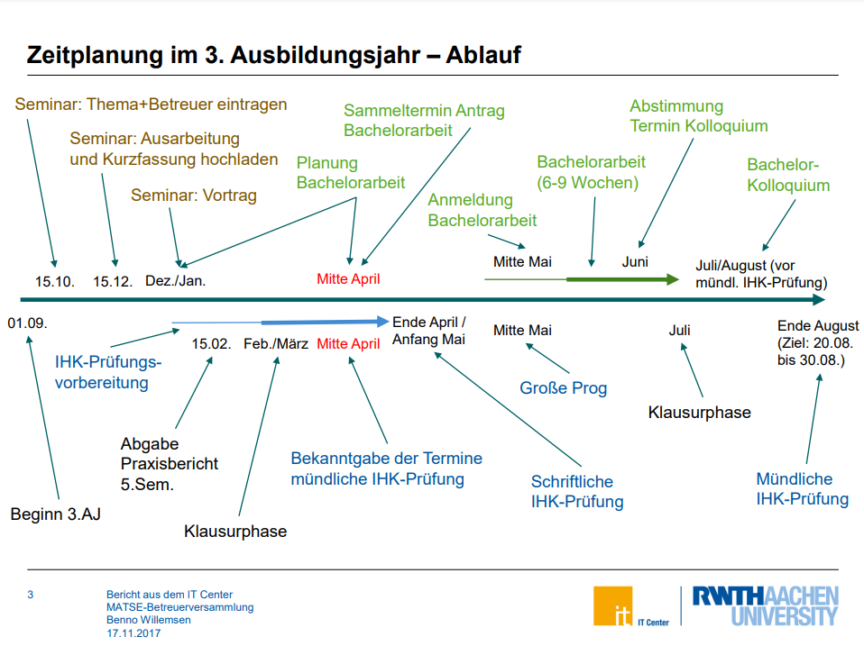

# Bachelor Thesis Project

## Genereller Ablauf

- [x] Antragstellung zur Zulassung zur Bachelorarbeit
- [ ] Ausfüllen und Abgabe des Laufzettels
  - [ ] Thema
  - [x] 1. Betreuer: Hochschullehrer an der FH Aachen
  - [ ] 2. Betreuer: Aus dem Betrieb; Muss mindestens Bachelor besitzen
  - [ ] Festlegung des Bearbeitungszeitraums
- [ ] Durchführung der BA
  - Min. 6 und Max 9 Wochen Bearbeitungszeit
  - 12 ECTS ~ 360h
- [ ] Kolloquium
  - Maximal 30min insgesamt
  - Genaue Bedingungen sind mit betreuendem Prof zu klären
  - Sollte zeitnah zur Abgabe der BA stattfinden
- [ ] Exmatrikulation :)

  

 
## Themenfindung
[Mind-Map zur Themeneingrenzung](https://www.mindmeister.com/map/2253267920)  

Das Thema kann allgemein aus einem der beiden folgenden Bereiche ausgewählt werden:

- ein empirisches, experimentelles, programmiertechnisches oder mathematisches Thema
- ein fachliterarisches Thema

**Wichtig: Min. 50% Theorieanteil**

### Expose
Thema in 2 Din A4-Seiten mit einfacher Struktur präsentieren.
- **Titel**, der das Thema auf den Punkt bringt
- **Name und Datum:** Direkt unter dem Titel
- **Hintergrund:** Schreibe auf, was das Thema motiviert, was das Themenumfeld ist (care why!); arbeite gegebenenfalls Literatur ein
- **Frage- bzw. Problemstellung:** Gibt es eine Grundannahme? Was ist das Thema und das Problem? Worum geht es? Stelle Entwicklungs- & Erkenntnisziel vor und erläutere beidies. Ideal: Erarbeite eine Grafik, die einen entscheidenden Sachverhalt überzeugend veranschaulicht! Erkläre die Abbildung
- **Vorgehensweise:** Wie ist das weitere Vorgehen geplan? Woran lässt sich festmachen, ob das Entwicklungsziel erreicht ist? Und wie wird die Erkenntnis abgeleitet/generiert?
- **Literaturverzeichnis:** Klassifiziere die Quellen

### Hilfe
- [Bachelorarbeit Informatik: Wie finde ich ein gutes Thema](https://www.youtube.com/watch?v=CEJfGRxKt5Q)
- https://docs.google.com/document/d/1TZT8N2usivaTFzsxB-TzV2dT7M7oyuvG7VU0AbGHpcE/edit
- [Elmar Juergens: Wie schreibe ich eine erfolgreiche Bachelorarbeit (oder Masterarbeit) in Informatik?](https://www.youtube.com/watch?v=wV0QURyJ0f8)
- https://thesisguide.org
- [Fokus der Arbeit](https://anchor.fm/dominikusherzberg/episodes/WAI-Der-Fokus-Ihrer-Bachelorarbeit-Entwicklung-oder-Erkenntnis--Oder-beides-enaio5/a-a41668e)

### Publikationen in der Informatik
- Gesellschaft für Informatik
- ACM
- IEEE
